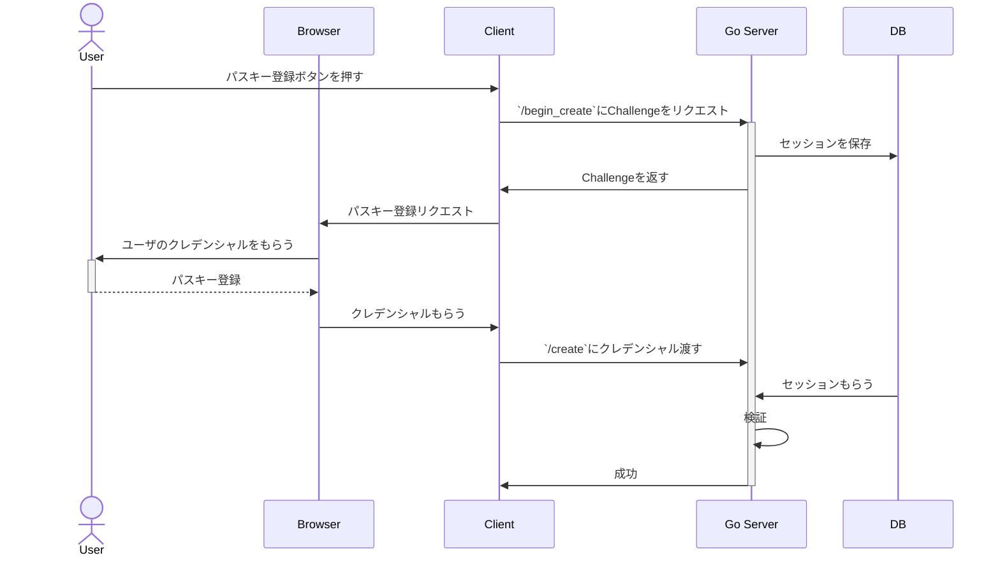

# WebAuthn Sample

## TL;DR

- バックエンドをGo、フロントエンドをNext.jsを使用してWebAuthnを使用した登録とログインが使用できるか検証するリポジトリ
- Goでは、[`github.com/go-webauthn/webauthn`](https://github.com/go-webauthn/webauthn)を使用してWebAuthnの周りをいい感じに実装している
- Next.jsでは[`@github/webauthn-json`](https://github.com/github/webauthn-json)を使用して便利に認証している

## 起動

```bash
# install deps
go mod download
pnpm i

# Run
go run .
pnpm dev

# Access to http://localhost:3000
```

## 登録フロー

URL: [`/register`](http://localhost:3000/register)



## ログインフロー

### Conditional UIを使用したログイン

- [Conditional UI](https://github.com/w3c/webauthn/wiki/Explainer:-WebAuthn-Conditional-UI)を使用すると、Input要素にフォーカスしたときでパスキーを登録していると候補が表示されます。
- 執筆現在はドラフトなのでブラウザのサポート状況にムラがあります。
- Google ChromeやSafariは対応しているが、Firefoxは対応していない。
  - UAを見てFirefoxのときはボタンを生やすような実装にしています。

URL: `/login_auto`

実装時のTips:

- ページロード時にサーバからチャレンジをもらい`navigator.credentials.get`を実行します。`get`は非同期関数であるため、ユーザがInput要素にフォーカスしてWebAuthnを使用する選択をするまで待機されます。
  - 非同期で待機するため、別ページに遷移した場合動作を止めるために`AbortController`を使用する必要があります。
- Conditional UIを使用するには、`navigator.credentials.get`の引数のObjectで`mediation`プロパティを`conditional`にして、Input要素の`autocomplete`属性に`webauthn`を追加します。`autocomplete`は一緒に`password`か`username`がついている必要があります。

### ボタンを使用したログイン

- ボタンを押すとWebAuthnのAPIが発動します。

## LICENSE

[MIT](./LICENSE)
